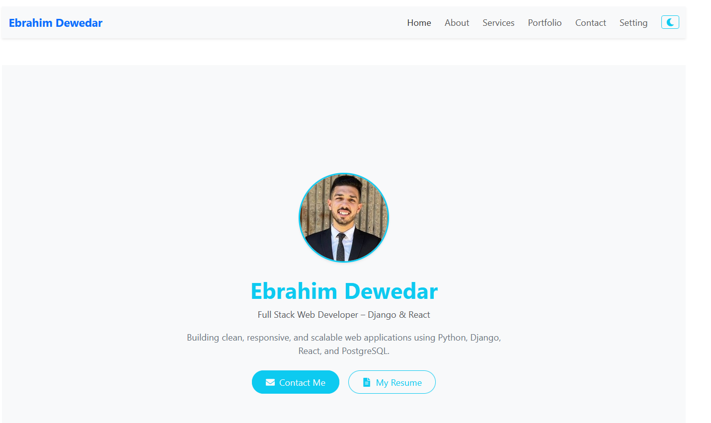
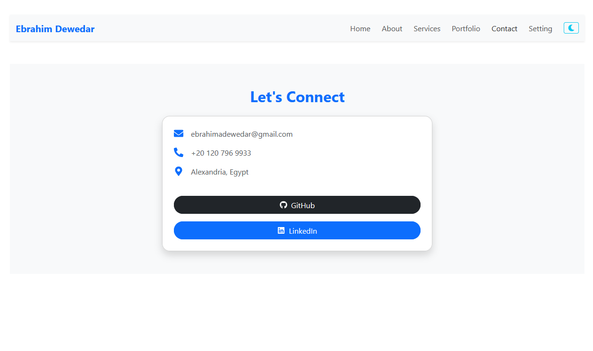

# 🌟 Ebrahim Dewedar - Portfolio Website

Welcome to my personal portfolio built with **React.js**!  
This website highlights some of my best work, technical skills, and ways to contact me.

---

## 🖼️ Screenshots

### 🎯 Homepage

### 🛠️ About Section

### 📄 Contact Page

---

## 🚀 Project Overview

This is a responsive single-page application (SPA) developed using **React** and **Bootstrap**. It features:

- Clean UI/UX design
- Featured project cards with GitHub & Live Demo links
- Dynamic routing to individual project pages
- A contact page with social profiles

---

## 🧰 Technologies Used

- ⚛️ React.js (with React Router)
- 🎨 Bootstrap 5
- 🧾 HTML5 & CSS3
- 📦 JavaScript (ES6+)
- 🎯 Vite

---

## 📂 Project Structure

src/
├── assets/ # Images and icons
├── components/ # Reusable components like cards
├── pages/ # Pages: Home, About, Contact, Portfolio, etc.
├── App.jsx
├── main.jsx

---

## 🔗 Live Demo

Visit the live site here:  
👉 
---

## 📬 Contact Me

- 📧 **Email:** ebrahimadewedar@gmail.com  
- 📱 **Phone:** +20 120 796 9933  
- 🔗 **LinkedIn:** [linkedin.com/in/ebrahim-dewedar](https://linkedin.com/in/ebrahim-dewedar)  
- 🐙 **GitHub:** [github.com/EbrahimDewedar](https://github.com/EbrahimDewedar)

---

## 📌 Goals of This Project

- Build a responsive and professional portfolio using React
- Apply component-based architecture
- Use routing for better navigation
- Showcase real-world projects with links
- Deploy it live to the web (Vercel/Netlify)

